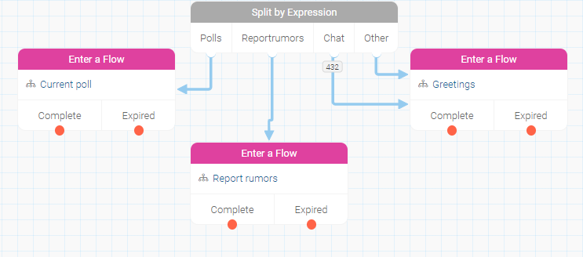
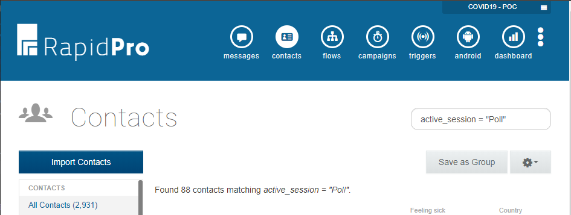
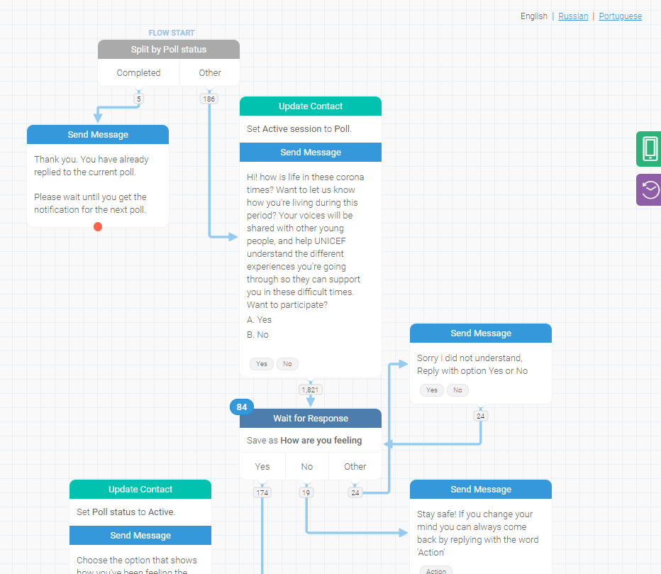
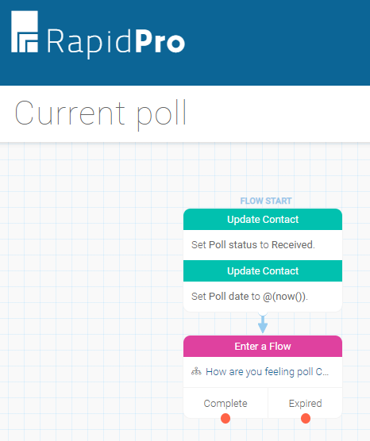

# HealthBuddy Mobile App 

## RapidPro flows for web & mobile channels action points

### A new user should be able to participate in polls, report rumors and use the chat feature.

This is being addressed by the app using three contacts for each account.  
On the RP side, these accounts may flow through different *triggers* (app session identifiers - chat, reportrumors, poll), starting respective flows - which is currently in use.  
Another option is to make one flow address which option should be started by the identifier string and all triggers would point to this flow.

I suggest using the last option, as it will also allow a single flow to setup the contact by addressing the contact's preferred language.  

### Design RapidPro flows to ensure disaggregation of users using mobile app, participating in polls, reporting rumors and using the chat feature.

Created a contact field called **Active session** (that should also be set en every poll flow) which will allow an administrator to see the number of active contacts on each session.  
The suggested values are:  
1. Poll - for users that started a poll;
2. Chat - for users that started the chat;
3. Rumor - for users that started to report a rumor.

Using the search option on [contacts](https://rapidpro.ilhasoft.mobi/contact) the administrator may use `active_session = "Poll"` in other to sort contacts accordingly, just replace `Poll` with the option.  

Saving the query will create Dynamic groups, so splitting contacts is also possible.  

### Within RapidPro, make provisions using ‘groups’  to target a poll to only mobile app users.

Changed the flow name **Set language WEB** to **Contact setup**. In this flow, created a contact field called **Channel name** and this will allow the creation of as many **Dynamics groups** as needed for all the workspace channels.

ATM I created two, one for Telegram and one for Mobile.  
**Channel - Telegram** uses `channel_name = "Ecaropoc Telegram"`.  
**Channel - Mobile app** uses `channel_name = "HealthBuddy Mobile app"`.  

> Headsup: to achieve this functionality I had to edit the channels' names and run a flow to update contact's info retroactively, _Contacts adjustment_. New contacts will populate this field automatically and the flow through the **Contact setup**.

#### Should a user who has participated in the most recent poll attempt to take the same poll again, the user should receive confirmation notification of their previous participation.  

Two options can be applied to achieve this:  

**First** an _Active poll_ group can be created and a contact should be added to it once the poll flow is completed, then the first action of every poll flow should be a split in order to see if the contact is already inside that group.  

**Second** a _Poll status_ contact field should be used update in the following steps:  
1. At the begging of the flow to **check if** _Completed_;  
2. Right after replying to the first question, **updating with** _Started_;  
3. After replying to all poll flow questions, **updating with** _Completed_;  

This will allow the creation of **Dynamic groups** for each scenario just by using, for instance, `poll_status = "Completed"`.  

> In the next topic I will explain another status, called _Received_.

When _Completed_ a Send message will allow the contact to know that the poll has already been responded.  
In my opinion, the second option works better in a larger scenario. I added this in the poll flow as an example.  

#### New and existing users should receive push notifications of the most recent poll(s) released.

Created the flow **Current poll** which completes the strategy for already registered contacts and the ones registered after the poll's broadcast.  

Updating _Poll status_ to **Received** will allow to see which contacts received the poll successfully but took no further action.  
_Poll date_ contact field will save the date this poll has been started in order to compare it with the contact's registration date.  
The third action is to make the contact enter the new poll flow.  

Here's how it works:  

1. The workspace admin creates a **poll flow** following the _Poll status_ and _Active session_ standards;  
2. This **poll flow** should be set in the **Current poll** flow in the _Enter a Flow_ action. This needs to be updated every time a new poll flow is about to be launch;  
3. The admin starts the **Push notification** so the app backend broadcast the action to all accounts;  
4. The user receives the push notification and by clicking on it the _poll trigger_ starts the flow, _Poll status_ is updated to _**Received**_ or _**Stated**_ (as the user interacts);  
4.1. If the user ignores the push notification and open the app, going to app's home screen, once they open Poll session the same _poll trigger_ action will take place;  
4.2. If the user just registered (installed and opened the app), once they open the Poll session the same _poll trigger_ action will take place;  
5. Once the poll is completed, _Poll status_ is updated to _**Completed**_ and if users try to start it again a message will advise waiting until the next poll is launched because the current one was already responded.

> I remember we've argued about using a [Campaing](https://rapidpro.ilhasoft.mobi/campaign) in order to sort for contacts that registered after a poll that has been launched. The problem is that the Push notification message is always broadcasted, by the app's backend, for all accounts and RP just doesn't know which one received it already. The worse thing in this scenario is that even if I create a scheduled event to sort contacts which didn't reply to the last Poll (which is completely possible) I can't let them know there's an ongoing Poll because a push notification would be received by everyone, not just the sorted contacts.  
In this scenario, using any scheduled event isn't possible on the RapidPro side.

### Update gender and country information through RapidPro flows (potentially use a poll strategy)

Already under evaluation on https://staging.healthbuddy.info

### Create a campaign triggered say 10 minutes after a new user registers. Create a contact field to identify new users who have not received push notifications for a poll released.

**In progress...**

### Design custom flows for mobile app users. (Quick reply treatment for reporting rumors will be different form web)

**In progress...**

### Implement a campaign to address spamming by tracking the number of messages a user has sent in as specified time frame and blocking the contact.

**Under evaluation...**